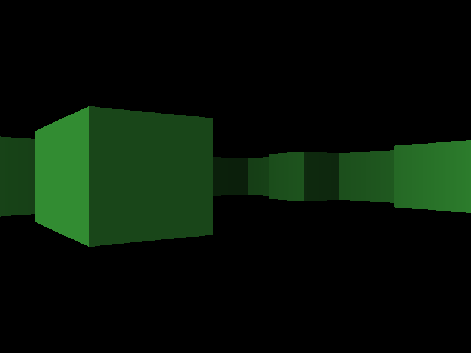
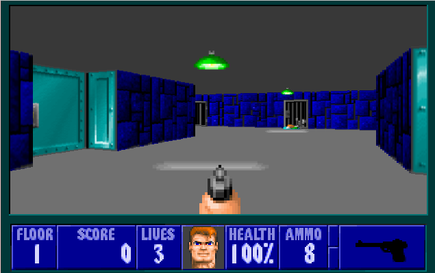
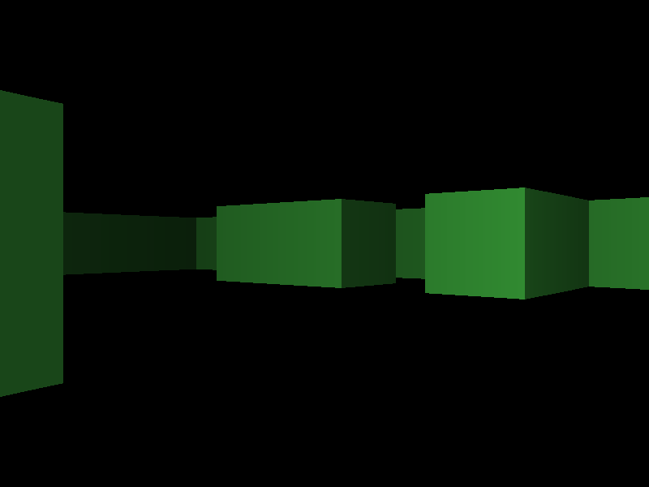

# Wolf 3D Clone

## Content
* [About](#about)
* [Current state](#current-state)
* [Build](#build)

## About

This is clone (*currently in development*) of the legendary [Wolfenstein 3D](https://en.wikipedia.org/wiki/Wolfenstein_3D) video game, first-person shooter developed by **id Software**. Originally released on May 5, 1992 for MS-DOS.

Like the original clone is written in [Pure C](http://lurkmore.to/Pure_C).

|                         4:19                         |                        4:20                       |
|:----------------------------------------------------:|:-------------------------------------------------:|
|||

## Current state

Now the game is at the stage of early development. There is nothing but bare walls. So the only thing that you can do in it is mindlessly run around the level without textures.

## Build

Game tested on **Arch Linux** with **gcc 7.1.1**.

List of the **requirements**:
* [gcc](https://gcc.gnu.org/) with support C99
* [make](https://www.gnu.org/software/make/)
* [OpenGL](https://www.opengl.org/)
* [GLEW](http://glew.sourceforge.net/)
* [SDL2](https://www.libsdl.org/)

Enter project directory in console and type `make` to build it. If the compilation succeeds, a `wolf3d` file appears in the project's root folder and you can launch it. Or you can simply write `make run` and then the game will start right after the compilation is completed.